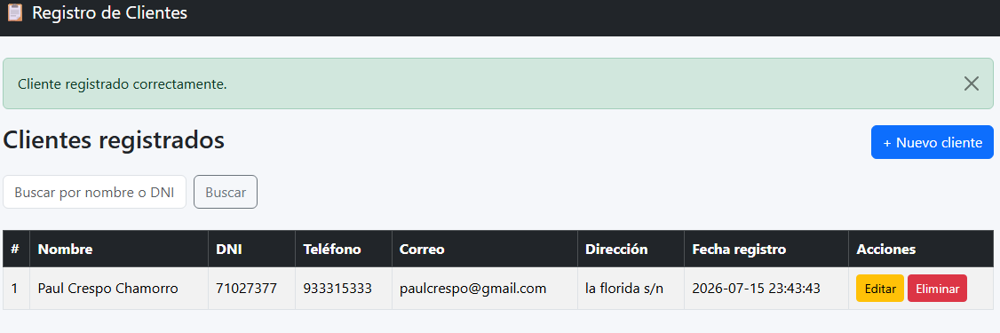
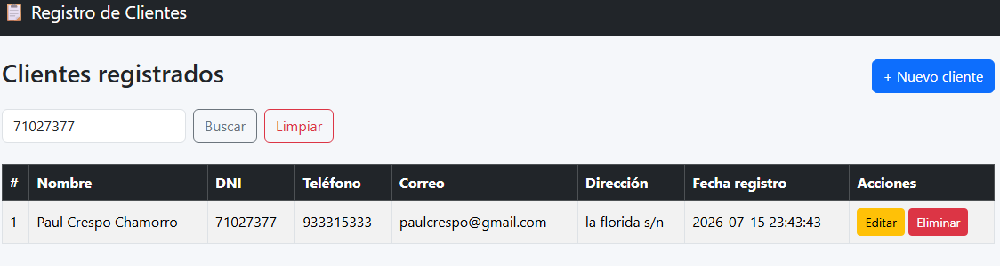

# 📋 Registro de Clientes

## 🎯 Objetivo

Desarrollar una aplicación web que permita registrar, consultar, buscar, editar y eliminar información de clientes de forma rápida, ordenada y centralizada, resolviendo el problema de la falta de un sistema organizado para esta gestión en pequeños negocios o emprendimientos.

##  Descripción de la aplicación

Registro de Clientes es una aplicación web desarrollada como proyecto final del curso de Modelamiento de Software. Permite:

- Registrar nuevos clientes con sus datos (nombre, DNI, teléfono, correo, dirección).
- Listar todos los clientes registrados.
- Buscar clientes por nombre o DNI.
- Editar la información de un cliente existente.
- Eliminar un cliente del registro.

El DNI cuenta con validación tanto en el navegador como en el servidor, asegurando que solo se acepten 8 dígitos numéricos.

##  Tecnologías utilizadas

- **Python 3.14** — lenguaje de programación principal.
- **Flask 3.1.3** — framework web para el backend.
- **SQLite** — motor de base de datos.
- **HTML5 + Bootstrap 5** — estructura y estilos del frontend.
- **Git y GitHub** — control de versiones.

##  Capturas de pantalla

### Pantalla principal (listado de clientes)


### Formulario de registro


### Búsqueda de clientes


##  Instrucciones de ejecución

1. Clona el repositorio:
```bash
   git clone https://github.com/brandoncrespo21/mi-primer-proyecto.git
```

2. Ingresa a la carpeta del código fuente:
```bash
   cd mi-primer-proyecto/codigo_fuente
```

3. Instala las dependencias:
```bash
   pip install -r requirements.txt
```

4. Ejecuta la aplicación:
```bash
   python app.py
```

5. Abre tu navegador en:
http://127.0.0.1:5000

##  Enlace del repositorio

[https://github.com/brandoncrespo21/mi-primer-proyecto]
(https://github.com/brandoncrespo21/mi-primer-proyecto)

##  Autor

Brandon Crespo — Instituto de Educación Superior Tecnológico Público Oxapampa